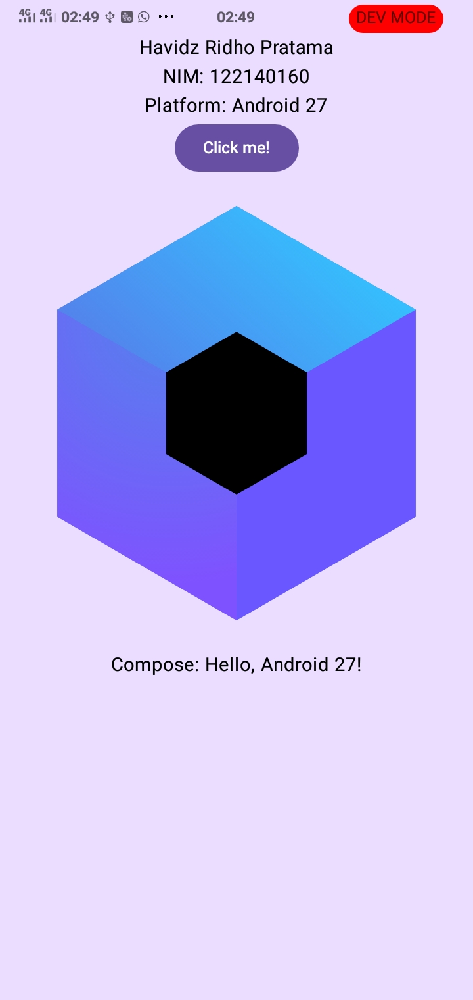
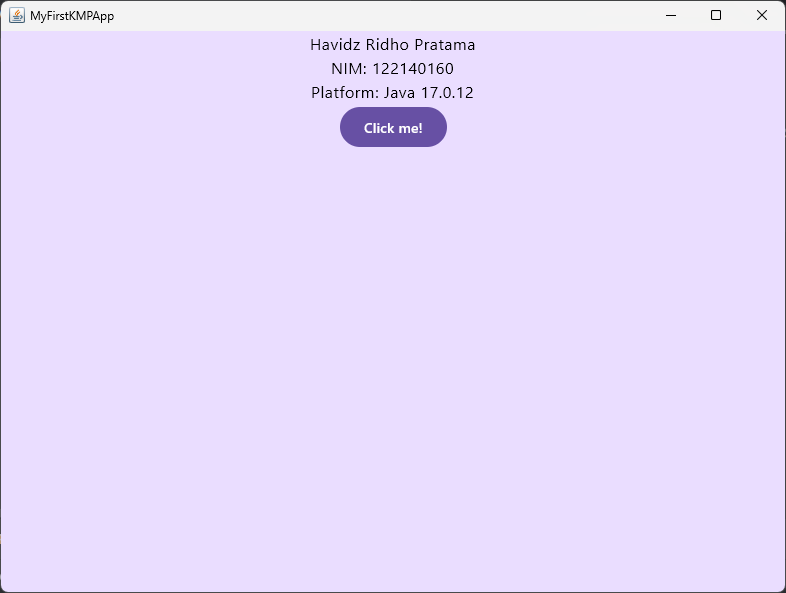
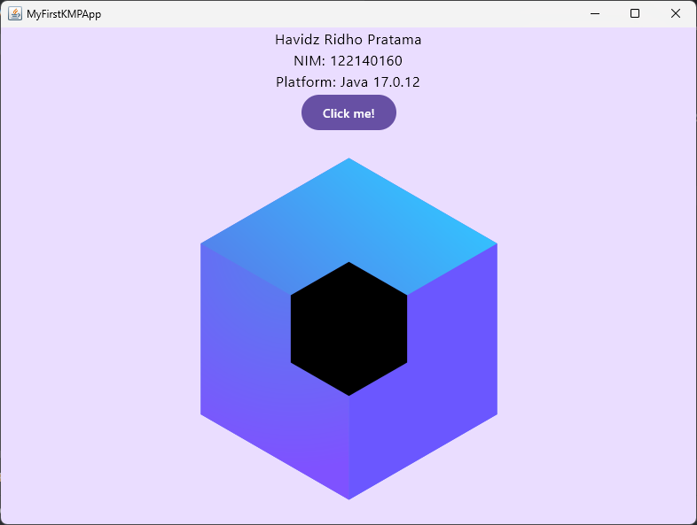

# Tugas 1: Pengenalan Kotlin Multiplatform (KMP)
**Pengembangan Aplikasi Mobile**

## Biodata
- **Nama:** Havidz Ridho Pratama
- **NIM:** 122140160
- **Kelas:** PAM-RA

## Deskripsi Tugas
Tugas ini merupakan pengenalan awal framework Compose Multiplatform untuk membuat aplikasi yang berjalan di berbagai platform (Android & Desktop).

### Modifikasi Kode
Saya telah memodifikasi file `App.kt` untuk menampilkan:
1. Nama lengkap.
2. Nomor Induk Mahasiswa (NIM).
3. Nama platform yang sedang menjalankan aplikasi menggunakan fungsi `getPlatformName()`.

## Bukti Eksekusi (Screenshot)

### 1. Platform Android (Emulator/Fisik)

### 2. Platform Desktop (Windows)

